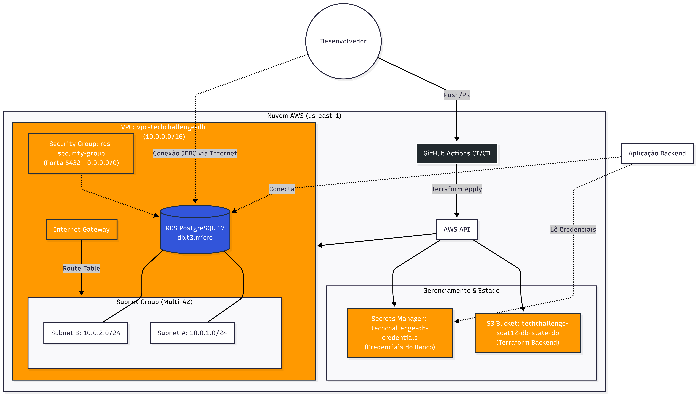

# 🏛️ Tech Challenge Fase 3 - Infraestrutura de Banco de Dados

Este repositório contém o código de **Infraestrutura como Código (IaC)** utilizando **Terraform** para provisionar o banco de dados da aplicação Tech Challenge (Fase 3).

O objetivo é fornecer uma camada de persistência robusta, segura e gerenciada na nuvem AWS, substituindo bancos de dados em containers locais/Kubernetes por um serviço gerenciado (RDS).

---

## 📋 Índice
- [Arquitetura](#-arquitetura)
- [Tecnologias Utilizadas](#-tecnologias-utilizadas)
- [Justificativa da Escolha (Requisito FIAP)](#-justificativa-da-escolha)
- [Pré-requisitos](#-pré-requisitos)
- [Como Executar Localmente](#-como-executar-localmente)
- [Pipeline CI/CD](#-pipeline-cicd)
- [Integração com a Aplicação](#-integração-com-a-aplicação)

---

## 🏗 Arquitetura

A infraestrutura provisionada inclui:

1.  **VPC & Networking:** Criação de uma Virtual Private Cloud (VPC) dedicada, com Subnets em diferentes Zonas de Disponibilidade (AZs) para garantir conformidade com requisitos de alta disponibilidade.
2.  **Security Group:** Firewall virtual permitindo tráfego na porta `5432` (PostgreSQL).
3.  **Amazon RDS:** Instância de banco de dados gerenciado PostgreSQL (Camada Free Tier - `db.t3.micro`).
4.  **AWS Secrets Manager:** Armazenamento seguro das credenciais do banco. A aplicação busca usuário/senha aqui, eliminando dados sensíveis hardcoded.
5.  **S3 Backend:** O estado do Terraform (`.tfstate`) é armazenado remotamente em um bucket S3 para garantir consistência e trabalho em equipe.

> **Diagrama da Infraestrutura:**
> 
> 

---

## 🚀 Tecnologias Utilizadas

* **Terraform:** Orquestração da infraestrutura.
* **AWS RDS (PostgreSQL 16.3):** Banco de dados relacional gerenciado.
* **AWS Secrets Manager:** Gestão de credenciais e rotação de senhas.
* **AWS S3:** Armazenamento do estado do Terraform.
* **GitHub Actions:** Pipeline de CI/CD para deploy automático.

---

## 💡 Justificativa da Escolha

Conforme solicitado nos requisitos do Tech Challenge:

### 1. Por que PostgreSQL?
Optamos pelo **PostgreSQL** devido à sua robustez, conformidade ACID (Atomicidade, Consistência, Isolamento e Durabilidade) e suporte avançado a dados relacionais complexos exigidos pelo sistema de gerenciamento da oficina (Clientes, Veículos, Ordens de Serviço). É um banco Open Source com ampla comunidade e suporte.

### 2. Por que Amazon RDS (Serviço Gerenciado)?
A migração de um banco em container (Kubernetes) para o **Amazon RDS** foi realizada para elevar o nível de operação:
* **Gerenciamento:** A AWS cuida de backups, atualizações de segurança e manutenção do SO.
* **Escalabilidade:** Facilidade para escalar verticalmente (tamanho da instância) ou horizontalmente (Read Replicas) se necessário.
* **Segurança:** Criptografia em repouso e em trânsito, além de integração nativa com IAM e Security Groups.

### 3. Ajustes no Modelo
O esquema do banco é gerenciado via **Liquibase** (no repositório da API), garantindo que o versionamento da infraestrutura (Terraform) e o versionamento dos dados (Migrations) andem juntos, mas desacoplados.

---

## 🛠 Pré-requisitos

Para executar este projeto localmente, você precisa:

1.  **Conta AWS:** Com permissões de Administrador ou acesso a RDS, VPC, S3 e Secrets Manager.
2.  **Terraform CLI:** Instalado (versão 1.5+).
3.  **AWS CLI:** Instalado e configurado.
4.  **Bucket S3 para Backend:** Um bucket S3 deve ser criado manualmente na AWS antes de rodar o código (ex: `techchallenge-soat12-db-state-prod`).

---

## 💻 Como Executar Localmente

### 4.  Executar arquivo para setar as váriaveis localmente
```
    .\update_creds.ps1
```
1. **Clonar o repositório:**
    ```bash
    git clone https://github.com/SOAT12/techchallenge-12SOAT-db.git
    ```
2. **Criar bucket na AWS e alterar no arquivo providers.tf o seu devido nome:**
    ```bash
    bucket = "techchallenge-soat12-db-state-db"
    ```

3. **Criar arquivo update_creds.ps1 ou semelhante:**
   Este comando é utilizado para salvar as variáveis AWS_ACCESS_KEY_ID E AWS_SECRET_ACCESS_KEY da AWS.
    ```bash
    $Env:AWS_ACCESS_KEY_ID="TOKEN"
    $Env:AWS_SECRET_ACCESS_KEY="TOKEN"
    Write-Host "Credenciais atualizadas com sucesso!"
    ```
   
3. **Executar arquivo para setar as váriaveis localmente:**
    ```bash
    .\update_creds.ps1
    ```
   
4. **Inicialize o Terraform:**
   Este comando prepara o diretório de trabalho, baixando os provedores necessários e configurando o backend.
    ```bash
    terraform init
    ```

5. **Valide a configuração:**
   Este comando faz uma verificação de sanidade para garantir que a sintaxe dos seus arquivos de configuração está tecnicamente correta.
    ```bash
    terraform validate
    ```

6.  **Gere um plano de execução:**
    Este comando cria um plano que permite visualizar as alterações (criações, atualizações, destruições) que o Terraform fará na infraestrutura. É um passo crucial para revisar e garantir que as mudanças estão corretas antes de aplicá-las.
    ```bash
    terraform plan
    ```

7.  **Aplique a configuração para criar a infraestrutura:**
    Após revisar o plano e confirmar que as alterações estão corretas, execute este comando para aplicar as mudanças. Você precisará digitar `yes` para confirmar e provisionar a infraestrutura.
    ```bash
    terraform apply
    ```